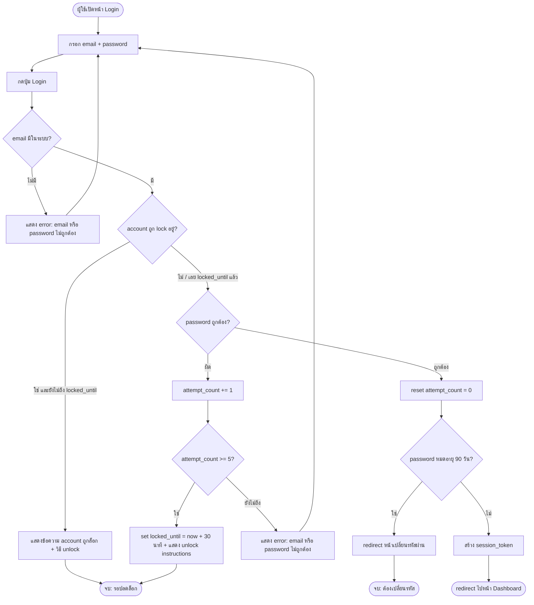

# User Flow — ระบบ Login

---

## Flowchart

---

## Logic Paths สรุป

| Path ID | ประเภท | คำอธิบาย |
|---------|--------|----------|
| LP-1 | Happy Path | email มี + password ถูก + รหัสไม่หมดอายุ → สร้าง session → dashboard |
| LP-2 | Negative | password ผิด (ยังไม่ครบ 5) → error + attempt_count +1 |
| LP-3 | Negative | email ไม่มีในระบบ → error กลาง ๆ |
| LP-4 | Edge Case | login ผิดครบ 5 ครั้ง → lock account + unlock instructions |
| LP-5 | Edge Case | account ถูก lock อยู่ (ยังไม่ถึง locked_until) → ปฏิเสธทันที |
| LP-6 | Edge Case | password ถูกต้องแต่หมดอายุ 90 วัน → บังคับเปลี่ยนรหัส |

---

## Field Definitions

| Field | Type | คำอธิบาย |
|-------|------|----------|
| `email` | string | อีเมลผู้ใช้ ใช้เป็น identifier ในการ login (ต้องเป็นรูปแบบ email ที่ถูกต้อง) |
| `password` | string | รหัสผ่าน ส่งแบบเข้ารหัส ฝั่ง server เก็บเป็น hash เท่านั้น |
| `attempt_count` | integer | จำนวนครั้งที่ใส่รหัสผิดติดต่อกัน reset เป็น 0 เมื่อ login สำเร็จ |
| `locked_until` | datetime / null | เวลาที่ account จะปลดล็อก ถ้า null = ไม่ถูก lock |
| `session_token` | string | token ที่ออกให้หลัง login สำเร็จ ใช้ยืนยันตัวตนในแต่ละ request หมดอายุตาม session timeout |
